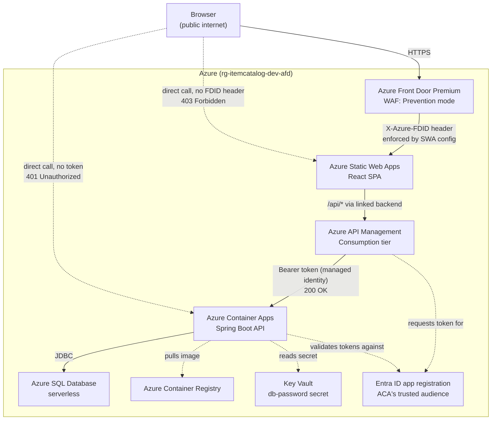

# item-catalog infra (API Management + Front Door variant)

Terraform for the item-catalog platform with Azure Front Door Premium in front of everything: a
React single-page app on Azure Static Web Apps, calling Azure API Management, which calls a Spring
Boot REST API on Azure Container Apps, backed by Azure SQL Database - with Front Door as the single
public entry point in front of the Static Web App. This is a sibling to `item-catalog-infra-apim`,
copied from it (not from the plain `item-catalog-infra`), since Front Door here sits in front of the
already-APIM-fronted stack specifically. All three repos are permanent, independently valid reference
architectures, and none should be able to break either of the others:

| Repo | Architecture |
|---|---|
| `item-catalog-infra` | `Browser → SWA → ACA → SQL` |
| `item-catalog-infra-apim` | `Browser → SWA → APIM → ACA → SQL` |
| `item-catalog-infra-apim-afd` (this repo) | `Browser → AFD → SWA → APIM → ACA → SQL` |

The architecture keeps the same constraints as the other two variants: lowest reasonable operational
overhead, cost that scales to near-zero when idle, and no standing credentials anywhere in the
request path. Front Door doesn't change that - it adds a WAF, not a credential.

A separate environment (`rg-itemcatalog-dev`) already exists in this subscription, built manually
through the Azure Portal - including its own manually-configured Front Door profile, WAF policy, and
origin restriction, added and hardened in that same manual environment before this Terraform
reproduction existed (see the companion Azure Front Door: Portal How-To doc). It remains untouched.

## Architecture



Browser is the only thing outside the boundary - every arrow crossing into it, including the two
dashed "this should fail" bypass attempts, originates from the public internet and hits an Azure
resource that's expected to reject it. That's a visual restatement of the point made just below:
Front Door plus origin restriction is meant to be the *only* legitimate way across that boundary.

Three independent boundaries, not one: Front Door's WAF plus SWA's origin restriction gate the
browser-facing edge; APIM's managed-identity handoff gates the APIM → ACA hop; ACA's own identity
gates its calls to ACR and Key Vault. Each is enforced by a different mechanism (a WAF policy, a
platform-validated AAD token, and RBAC role assignments, respectively) and none of them substitutes
for another - APIM being correctly hardened doesn't matter if a browser can still reach SWA directly,
which is why origin restriction exists at all (see below).

## What Azure Front Door is, and why this architecture has it

**What it is**: a global, edge-based application delivery network - a layer of Microsoft-operated
points of presence (PoPs) distributed worldwide, sitting in front of one or more origins and reached
through anycast DNS (the same public hostname routes each client to whichever PoP is nearest them).
At Standard tier it's essentially global HTTP(S) load balancing plus CDN-style edge acceleration; at
**Premium** tier (used here) it adds a managed **Web Application Firewall** - request inspection
against the OWASP core rule set and bot-management rules, enforced at the edge before traffic ever
reaches an origin. It's the same category of service as AWS CloudFront + AWS WAF, or Cloudflare -
Microsoft's version of "one global front door for the whole application," not specific to any one
backend technology behind it.

**Why an architecture reaches for this in general**: three things a WAF-backed edge layer gives you
that pushing security to each individual backend doesn't. First, centralization - one place to
enforce request-level security policy (SQL injection patterns, XSS payloads, bad bots, known exploit
signatures) instead of every service behind it needing to defend against the same threats
independently. Second, it's the layer that actually absorbs hostile traffic at Microsoft's edge,
globally, before it ever reaches your compute - your origins only ever see traffic Front Door decided
was legitimate. Third, a single public entry point: every other origin (the Static Web App here) can
be locked down to accept traffic *only* from Front Door, so there is exactly one thing on the public
internet that ever has to withstand direct hostile traffic, and everything behind it is reachable only
through a layer built and hardened specifically for that job.

**Why *this* architecture has it, specifically**: not because the item-catalog POC's data warrants
it - it's fake data with no real attacker interest, and Static Web Apps already provides its own
global CDN distribution, managed TLS, and custom domains natively without Front Door in front of it
at all. This exists as deliberate, hands-on practice with a component that *is* load-bearing for a
different, realistic class of system this POC stands in for: a customer-facing application handling
real PII or payment data (a customer self-service portal, an insurance or payment purchase flow),
where an edge WAF is a standard, expected part of the architecture, not an optional extra. The
capability actually being exercised here is narrow and deliberate: since SWA already covers CDN and
TLS, Front Door's entire value-add in this specific stack is the WAF plus the ability to make it the
*only* path in (see "Origin restriction" below) - which is also exactly why Premium tier was chosen
over Standard, and why `afd_waf_mode` defaults straight to `Prevention` rather than the softer
`Detection` default. A production system that actually needs this belongs on this pattern; this POC
doesn't need it, and says so plainly rather than pretending otherwise.

## File layout

Same reasoning as the other two repos: one root module, no subfolders, filenames carry a numeric
prefix so they sort into dependency-ordered groups.

| Prefix | Group |
|---|---|
| `00`-`03` | Terraform/provider config, variables, tags |
| `10`-`51` | Foundational resources: resource group, SQL, SQL app user, Key Vault, ACR, Log Analytics, ACA environment |
| `60`-`63` | Container App: identity, RBAC, the app itself, auth config |
| `70`-`71` | Static Web App + linked backend (links to APIM) |
| `80`-`83` | API Management: the instance, the API + operations + product, the Entra ID audience app registration, the inbound policy |
| `84`-`87` | Azure Front Door: profile + endpoint, origin group + origin, route, WAF policy + security policy |
| `90` | Outputs |

`60`-`83` are unchanged from `item-catalog-infra-apim` - this variant only adds the `84`-`87` layer on
top and the two new outputs it requires.

## Configuration model

Same as the other two repos - no driver file, every resource name is a variable with nothing
hardcoded in the resource blocks themselves, secrets never live in a variable default or `.tfvars`
file. `afd_waf_policy_name` has one hard constraint worth knowing before renaming it: Azure requires
WAF policy names to be alphanumeric only - no hyphens or underscores - enforced here via a
`validation` block rather than left to fail at `apply` time.

## Status

Validated end-to-end against a real `rg-itemcatalog-dev-afd` environment, including a full
destroy-and-rebuild cycle - the same level of confidence as the other two repos. The first-ever apply
hit one real error (`azurerm_api_management_api_policy.item_catalog` failing with `412 Precondition
Failed`, a genuine race between the policy write and the operation writes - see "APIM policy race"
under Troubleshooting); once fixed in the code (`83-apim-policy.tf`'s `depends_on` now forces the
operations to finish first), a completely fresh `destroy` followed by the full redeploy sequence (ACR
bootstrap, image push, apply, `staticwebapp.config.json` regeneration, UI redeploy) succeeded with
zero errors and no retries - 39/39 resources on the first attempt. All four verification checks
(origin-restriction `403`, Front Door `200`, the full data path `200`, and the direct-to-ACA `401`)
passed cleanly on the rebuilt environment, after the documented edge-propagation wait (~10-15 minutes,
observed on both the original build and the rebuild) for the new Front Door profile to finish
distributing its config globally.

Naming uses an `-afd` qualifier throughout (`rg-itemcatalog-dev-afd`, etc.), distinct from the manual
environment, the plain-ACA `dev-iac` Terraform environment, and the APIM-only `dev-gw` Terraform
environment - globally-unique-named resources here (SQL server, Key Vault, ACR, APIM, Front Door
profile, WAF policy) would otherwise collide with any of the other three.

## Front Door resources

All native `azurerm` resources - no AzAPI needed for anything in this layer, unlike the SWA
linked-backend and ACA auth config elsewhere in this project.

**`84-front-door.tf`**: the profile (`azurerm_cdn_frontdoor_profile`, Premium tier - see
`afd_sku_name`'s description for why Standard isn't an option here) and its endpoint
(`azurerm_cdn_frontdoor_endpoint`).

**`85-front-door-origin.tf`**: the origin group and the origin itself, pointed at the Static Web
App's `default_host_name`. Health probe protocol is pinned to `Https`, matching the route's
`HttpsOnly` forwarding protocol below - probing over `Http` against an HTTPS-enforcing origin risks a
redirect response reading as "unhealthy" (caught during the manual build before it became a real
problem). Session affinity and the load-balancing sample-size/latency settings are left at Azure's
defaults - both only matter with more than one origin, and this build has exactly one.

**`86-front-door-route.tf`**: `forwarding_protocol = "HttpsOnly"` is explicit, not "match incoming
request" - this removes even the narrow window where a plain-HTTP request could reach the origin
before the `https_redirect_enabled` rule applies. No `cache` block is present at all, which is how
this provider represents "caching disabled" - the origin serves a dynamic SPA shell, and caching was
deliberately left out of this first pass to avoid a "why is this stale" variable before the routing
and WAF flow is proven.

**`87-front-door-waf.tf`**: the managed rule sets and versions (`Microsoft_DefaultRuleSet` 2.1,
`Microsoft_BotManagerRuleSet` 1.0) match exactly what the manual build's "Create a new WAF policy"
quick-create dialog actually provisioned - confirmed via `az network front-door waf-policy show`
against the live manual environment, not guessed. `afd_waf_mode` defaults to `Prevention`, not
`Detection` - see the callout below for why that's not repeating a shortcut, but a deliberate
decision based on the manual build's own findings.

## Why this defaults straight to Prevention mode

The manual build's quick-create WAF dialog doesn't expose Detection vs. Prevention at creation time -
it silently defaults to Detection, and switching to Prevention had to be a separate, deliberate step
taken only after confirming Detection had already observed real traffic (every verification curl from
that build and the APIM build before it) without flagging anything as malicious. That validation is
already done - see the companion Azure Front Door: Portal How-To's "Hardening: WAF policy mode"
section for the full walkthrough and the before/after verification results.

Reproducing that two-step process here (create in Detection, then require a manual follow-up apply to
flip `afd_waf_mode` to Prevention) would just be re-running an experiment whose result is already
known, the same reasoning already applied to `81-apim-api.tf`'s `service_url` fix - baking a
known-correct value in from the start instead of reproducing a dead end on purpose. `afd_waf_mode`
stays a variable (not hardcoded) so a genuinely new environment, with genuinely new traffic patterns,
can still be deployed in Detection first if that caution is ever warranted again.

## Origin restriction: the part Terraform can't finish alone

Without origin restriction, Front Door is an optional, bypassable extra hop - the Static Web App's
own default hostname stays fully live and publicly reachable, so anyone who discovers it gets
identical access with zero WAF protection in front of it. This is the same "is this boundary real, or
just addable" question already solved for ACA (restricting callers to APIM's managed identity) and
for APIM (the auth handoff to ACA), one layer further out. Terraform creates every AFD resource
needed, but closing this specific gap requires one manual step outside Terraform's scope - and that's
deliberate, not an oversight.

**Why it can't be done in Terraform**: the mechanism (confirmed during the manual build; Private Link
isn't available for a Static Web App origin) is a `staticwebapp.config.json` file requiring two values
that don't exist until *after* `apply` finishes - the Front Door profile's ID and the endpoint's
hostname, both generated by Azure at creation time, not chosen. That file is also deployed via `swa
deploy`, not `terraform apply` - the same "React build/deploy is out of scope" boundary already
documented for the other two repos, now with one more field that depends on this repo's own output.

**What to do instead**, after this repo's `apply` finishes:

1. Read the two values Terraform generated. Run from **`item-catalog-infra-apim-afd/`**:
   ```
   terraform output -raw afd_front_door_id
   terraform output -raw afd_endpoint_hostname
   ```
2. Switch to **`item-catalog-ui/`**, copy `staticwebapp.config.json.example` to
   `public/staticwebapp.config.json` (gitignored - never commit this file with real values; see that
   repo's `.gitignore` for why) and fill in the two placeholders with the values from step 1.
3. Still from **`item-catalog-ui/`**, deploy the UI (see "Out of scope" below) - the config file only
   takes effect once it's actually in the deployed build, which requires it to live under `public/`,
   not the repo root (Vite only copies `public/`'s contents into `dist/`).

**Why this file can't just be committed with real values baked in**: `item-catalog-ui` is a shared
repo, also deployed unchanged to `dev-iac` and `dev-gw` - neither of which sits behind any Front Door
at all. A hardcoded Front Door ID there would make those environments' Static Web Apps reject all
traffic outright. The `.example` → real-file pattern used here mirrors the `.tfvars.example` → real
`.tfvars` pattern already used throughout this project's Terraform repos, extended to application
config instead of infrastructure config.

## SQL app user

Unchanged from the other two repos - `21-sql-user.tf` manages `db_app_user`/`db_app_password` via the
`betr-io/mssql` provider, needs `developer_public_ip` set for the machine running `apply`, and needs
`db_ddladmin` because the application relies on Hibernate's `ddl-auto=update` to create its own
schema.

## Deployment order

Same core constraint as the other two repos: the Container App's image must already exist in ACR
before `apply` creates it - the two-phase apply (target ACR, push the image, then apply everything
else) is still required here for the same reason. Front Door doesn't complicate this ordering
further - it depends on the Static Web App's `default_host_name`, not the other way around, so it's
created after SWA regardless, and nothing downstream of ACA needs to know Front Door exists at all.

One addition specific to this repo: Front Door configuration changes can take up to 15 minutes to
fully propagate (up to 30 for back-to-back changes) - not stuck if a freshly-applied route doesn't
respond instantly, this is a real Azure-side propagation delay documented in the portal wizard itself
during the manual build.

## Out of scope (by design)

Same three items as the other two repos, plus origin restriction (covered in its own section above,
since unlike the other three it's specific to this variant):

- **Docker build/push**. Run from **`item-catalog-service/`**:
  ```
  az acr build --registry <acr_name> --image <container_image_repository>:<container_image_tag> .
  ```
- **React build/deploy** - Terraform only creates the SWA resource. Run from **`item-catalog-ui/`**:
  ```
  export SWA_CLI_DEPLOYMENT_TOKEN=$(az staticwebapp secrets list --name <static_web_app_name> \
    --resource-group <resource_group_name> --query "properties.apiKey" -o tsv)
  npm run build
  swa deploy ./dist --env production
  ```
  Why the token: `swa deploy` overwrites what's actually served publicly, so it needs
  authentication - without it, anyone who knew the SWA's name could push arbitrary content. Like
  `TF_VAR_*`, it's a plain environment variable - it doesn't persist across terminal sessions, so a
  fresh tab needs it re-exported before `swa deploy` will work.
- **Origin restriction** - requires this repo's own Terraform outputs; see the dedicated section
  above.
- **Spring Boot Hikari resiliency** - an application-code change, not an infrastructure one; this
  architecture stacks *three* independently-serverless layers now (ACA scale-to-zero, SQL
  auto-pause, APIM Consumption tier) plus Front Door itself as a fourth cold layer in front - a cold
  request can hit any combination of these still warming up.

## Prerequisites

- Terraform >= 1.7.0
- Azure CLI, logged in with access to the target subscription:
  ```
  az login
  az account set --subscription "<subscription-name-or-id>"
  ```
- Same Entra ID permission requirement as `item-catalog-infra-apim`: creating `azuread_application`
  and `azuread_service_principal` (for the APIM → ACA auth chain, unchanged in this variant) needs
  Microsoft Entra ID permissions, not just Azure RBAC on the subscription.
- The `Microsoft.Cdn` resource provider must be registered on the subscription for the
  `azurerm_cdn_frontdoor_*` resources to create successfully:
  ```
  az provider show --namespace Microsoft.Cdn --query registrationState -o tsv
  az provider register --namespace Microsoft.Cdn   # only if not already Registered
  ```

## Secrets

Never put `sql_admin_password`, `db_app_password`, or `apim_publisher_email` in a `.tfvars` file, and
never paste their values anywhere outside your own terminal. Export the passwords:

```
export TF_VAR_sql_admin_password='...'
export TF_VAR_db_app_password='...'
```

For CI/CD, move the passwords to the pipeline's secret store and inject them as the same `TF_VAR_*`
environment variables at plan/apply time.

## Usage

**Run from this repo's root (`item-catalog-infra-apim-afd/`):**

```
cp terraform.tfvars.example terraform.tfvars   # edit non-secret values as needed, including
                                                # developer_public_ip and apim_publisher_email -
                                                # find your IP with: curl -s https://api.ipify.org
terraform init
terraform fmt -check
terraform validate
export TF_VAR_sql_admin_password='...'
export TF_VAR_db_app_password='...'
terraform plan -out=tfplan
```

## Full redeploy (after `destroy`, or from scratch)

Same five-step shape as the other two repos, plus the origin-restriction step this variant adds.
**Each step below names the directory it runs from - they are not all the same directory, and this
is the repo where mixing them up is easiest** (four different directories are involved across the
six steps).

Commands below assume you start in this repo's root (`item-catalog-infra-apim-afd/`) and use `cd`
with paths relative to wherever the previous step left you - the same sibling-directory layout used
throughout this project (`item-catalog-infra-apim-afd/`, `item-catalog-service/`, and
`item-catalog-ui/` all sit next to each other under `item-catalog/`).

1. Bootstrap just enough to push an image into. Run from **`item-catalog-infra-apim-afd/`**:
   ```
   terraform apply -target=azurerm_container_registry.this
   ```
2. Push the image. Switch to **`item-catalog-service/`**:
   ```
   cd ../item-catalog-service
   az acr build --registry <acr_name> --image <container_image_repository>:<container_image_tag> .
   ```
3. Apply everything else. Back in **`item-catalog-infra-apim-afd/`**:
   ```
   cd ../item-catalog-infra-apim-afd
   terraform plan -out=tfplan
   terraform apply tfplan
   ```
4. Generate the real `staticwebapp.config.json` using this apply's outputs - see "Origin restriction"
   above. Reads `terraform output`, so still from **`item-catalog-infra-apim-afd/`**:
   ```
   terraform output -raw afd_front_door_id
   terraform output -raw afd_endpoint_hostname
   ```
   Then edit `item-catalog-ui/public/staticwebapp.config.json` directly with those two values (or
   `cd ../item-catalog-ui` first if it's easier to work from there). Required every time after a
   fresh `apply` - the Front Door ID is a new GUID on every new profile; the endpoint hostname has
   been observed to stay the same across a destroy/recreate of the same profile name, but don't
   assume that's guaranteed - always use the freshly-output value.
5. Redeploy the UI. Switch to **`item-catalog-ui/`**:
   ```
   cd ../item-catalog-ui
   export SWA_CLI_DEPLOYMENT_TOKEN=$(az staticwebapp secrets list --name <static_web_app_name> \
     --resource-group <resource_group_name> --query "properties.apiKey" -o tsv)
   npm run build
   swa deploy ./dist --env production
   ```
6. Verify (see below). Switch back:
   ```
   cd ../item-catalog-infra-apim-afd
   ```

## Verification (post-apply)

Four checks - all four matter, not just the ones that should return `200`. **Run from
`item-catalog-infra-apim-afd/`** - these commands read `terraform output`, which only works from
this repo's root.

```
# Direct to the Static Web App, bypassing Front Door - the check that proves origin restriction is real
curl -i https://$(terraform output -raw static_web_app_default_hostname)/
# expect 403

# Through Front Door - expect 200
curl -i https://$(terraform output -raw afd_endpoint_hostname)/

# The full path, through Front Door, down to the database - expect 200 + JSON
curl -i https://$(terraform output -raw afd_endpoint_hostname)/api/v1/items

# Direct to ACA, no credentials at all - expect 401 (unchanged from item-catalog-infra-apim)
curl -i https://$(terraform output -raw container_app_fqdn)/api/v1/items
```

The first check is not optional, for the same reason the direct-to-ACA `401` check isn't optional in
the APIM variant: if it also returned `200`, origin restriction wouldn't actually be enforced - Front
Door and its WAF would be an optional extra hop, not the only way in, and none of the WAF hardening
would matter since traffic could simply route around it.

## Troubleshooting

Everything from `item-catalog-infra-apim`'s troubleshooting section still applies unchanged (SQL
firewall propagation, `MANIFEST_UNKNOWN`, `CREATE TABLE permission denied`, the APIM → ACA `401`
checklist, Entra ID permission errors, `Error: Saved plan is stale`, and the `412 Precondition
Failed` race below - present in that repo's `83-apim-policy.tf` too, just not yet hit there when
this was written). This section covers what's new specific to this repo.

- **Direct SWA access still returns `200`, not `403`, after deploying the config file.** Confirm the
  file actually made it into the build: it must live at `item-catalog-ui/public/staticwebapp.config.json`
  (not the repo root - Vite only copies `public/`'s contents into `dist/`), and the `swa deploy`
  output should explicitly say "Found configuration file." A root-level file will silently have no
  effect.
- **Origin health probe reports the origin unhealthy right after `apply`.** Confirm
  `85-front-door-origin.tf`'s probe `protocol` (`Https`) actually matches what the route forwards -
  this variant already pins both correctly, but if either is changed independently they can drift out
  of sync.
- **`curl` through Front Door returns `500 Backend call failure` intermittently, then clears on
  retry.** Expected cold-start behavior, not a fault - this stack now has four independently-scaling
  serverless-ish layers (ACA scale-to-zero, SQL auto-pause, APIM Consumption tier, and Front Door
  itself) in the request path. Seen during the manual build both after idle periods and immediately
  after redeploying a layer; retry before assuming misconfiguration. See the companion Front Door
  How-To's troubleshooting section for the full writeup, including the honest caveat that this was
  never proven via Azure's own logs.
- **`curl` through Front Door returns a generic Front-Door-branded `404 Page not found` (not a `500`,
  not SWA's own branded `403`/error page) for up to ~10-15 minutes right after `apply` creates a new
  profile/endpoint/route.** A *different* mechanism from the cold-start `500` above, worth not
  conflating with it - confirmed for real on this repo's first apply. `provisioningState: Succeeded`
  on the route/endpoint/security-policy (checked directly via `az afd route show` etc.) only reflects
  the ARM control plane accepting the resource definition. Front Door's actual edge network - the
  globally-distributed PoPs that anycast DNS routes real requests to - still has to receive that
  config separately, and that data-plane propagation is what the portal's own warning describes
  ("AFD configuration updates take up to 15 minutes to take effect; back-to-back changes may take up
  to 30 minutes"). A brand-new profile/route, or one that changed twice in quick succession (as this
  one did - initial create, then the `412` policy-fix retry below), sits on the longer end of that
  window. Not Terraform-solvable and not a sign of misconfiguration if every ARM resource already
  shows `Succeeded` with the correct config - wait and retry rather than re-applying or changing
  anything.
- **`azurerm_cdn_frontdoor_profile` or related resources fail to create with a provider-registration
  error.** See "Prerequisites" above - `Microsoft.Cdn` must be registered on the subscription.
- **`afd_waf_policy_name` rejected at `plan` time.** Must be alphanumeric only - no hyphens or
  underscores. Enforced by a `validation` block in `02-variables.tf`.
- **`terraform apply tfplan` fails with `Error: Saved plan is stale`.** A saved plan is a snapshot -
  it's only valid against the exact state it was computed from. Anything that changes state after
  the plan was saved invalidates it: most commonly here, running the "Bootstrap just enough to push
  an image into" targeted apply (Full redeploy step 1) *after* already saving a plan, rather than
  before. There is no way to "refresh" a stale plan file - discard it and generate a new one
  immediately before applying:
  ```
  terraform plan -out=tfplan
  terraform apply tfplan
  ```
  This is exactly why "Full redeploy" step 3 above shows `plan` and `apply` back to back as one
  step, not as separate steps with anything else in between - the moment something else touches
  state (a targeted apply, a change made outside Terraform, another person or process applying
  against the same state), any previously-saved plan is no longer trustworthy and must be redone.

## Destroy

`terraform destroy` will remove every resource this state manages, including the Front Door profile,
WAF policy, and the Entra ID app registration/service principal for the APIM → ACA auth chain. Do not
run it against the pre-existing manual environment's resource group. To bring the environment back
afterward, follow "Full redeploy" above from step 1 - remember step 4 (regenerating
`staticwebapp.config.json`) is required again, since the Front Door ID changes with every new profile.
